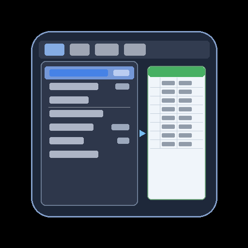

# alfred-menu

最前面のアプリケーションのメニュー項目をすべて取得し、Googleスプレッドシートに書き込む Alfred Workflow。

## 特徴

- 全メニュー階層を再帰的に取得（サブメニュー含む、階層上限なし）
- ショートカットキーの修飾キー（⌘⇧⌥⌃）とメインキーを自動取得
- シート名は `アプリ名_YYYY-MM-DD` で自動生成
- Alfred の設定画面で URL を入力するだけのシンプルな設定

## スプレッドシートの出力例

| 修飾キー | メインキー | Level1 | Level2 | Level3 |
|----------|-----------|--------|--------|--------|
| ⌘ | N | ファイル | 新規Finderウインドウ | |
| ⌘⇧ | N | ファイル | 新規フォルダ | |
| ⌘ | , | Finder | 設定... | |
| | | 表示 | ツールバーをカスタマイズ... | |

## インストール

### 1. Workflow のインストール

[Releases](https://github.com/hirshim/alfred-menu/releases/latest) から `alfred-menu.alfredworkflow` をダウンロードし、ダブルクリック。

### 2. Google Apps Script のセットアップ

1. Alfred で `menulist-setup` と入力 → GAS コードがクリップボードにコピーされる
2. 書き込み先の Google スプレッドシートを開く
3. **拡張機能 > Apps Script** を開く
4. エディタにコピーしたコードを貼り付けて保存
5. **デプロイ > 新しいデプロイ** をクリック
   - 種類: **ウェブアプリ**
   - 実行ユーザー: **自分**
   - アクセス: **全員**
6. **デプロイ** をクリックし、表示された URL をコピー

### 3. Workflow の設定

1. Alfred Preferences > Workflows > **Menu List** を開く
2. 右上の **[x]** アイコン（Configure Workflow）をクリック
3. **GAS Web App URL** に手順2でコピーした URL を入力

### 4. アクセシビリティ権限

システム設定 > プライバシーとセキュリティ > アクセシビリティ で **Alfred** を許可。

## 使い方

1. 対象のアプリを最前面にする
2. Alfred を起動して `menulist` と入力
3. スプレッドシートに自動で書き込まれ、完了通知が表示される

## キーワード一覧

| キーワード | 動作 |
|-----------|------|
| `menulist` | 最前面アプリのメニュー項目を取得してスプレッドシートに書き込む |
| `menulist-setup` | GAS コードをクリップボードにコピー |

## 設定項目

Alfred の Workflow 設定画面（Configure Workflow）で変更可能:

| 項目 | 説明 |
|------|------|
| GAS Web App URL | Google Apps Script の Web App URL（必須） |
| 無効なメニュー項目も含める | グレーアウトされた項目も取得する |

## 動作環境

- macOS
- Alfred 5（Powerpack）

## ライセンス

MIT
